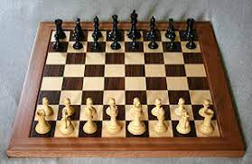

Competed for the Hawaii Homeschool Chess Club with numerous won championships, including winning High School State Chess Championship in my 10th, 11th, and 12th grade years.

Represented Hawaii in the invitation only Denker Tournament of National Chess Champions 3 times. 
