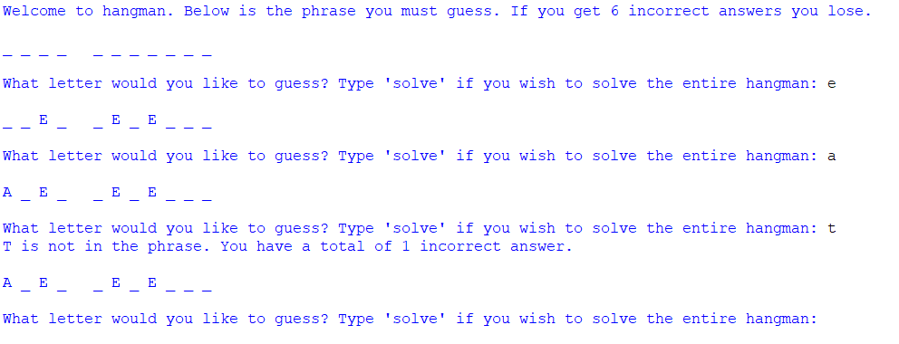

A playable Hangman game that properly handles invalid input and allows for solving the entire puzzle.

Coded in Python, this game demonstrates the concept of taking a simple game and programming it from scratch. It also has bonus functionalities such the ability to attempt the puzzle solution as a whole. 

Added functionality which allows for quick additions of future puzzles by simply adding strings to an array.
