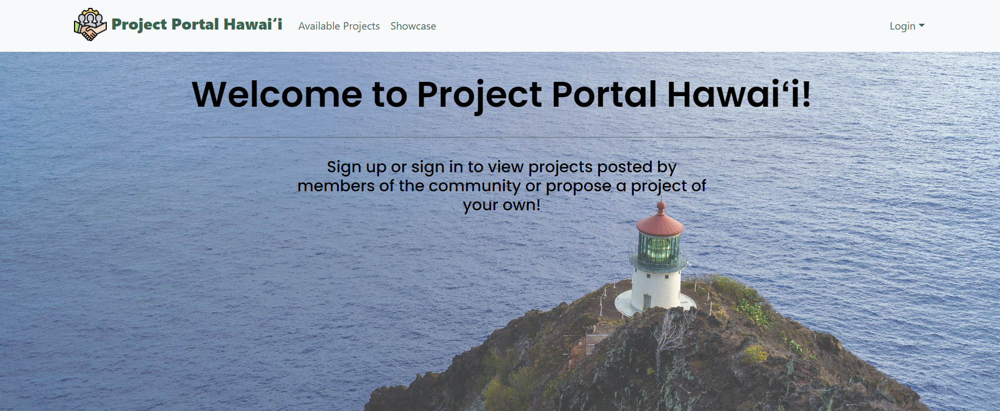

For web developers or those wishing to learn more about the code of this project, the source code is available here:
[https://project-portal-hawaii.github.io/](https://project-portal-hawaii.github.io/)

For those wishing to use or view the website portal the live deployment is available here: 
[https://project-portal.live](https://project-portal.live)https://github.com/project-portal-hawaii

The project that my team and I created is a portal for students or organizations to propose projects, have those projects reviewed, approved, and showcased. This project was created in accordance to the specifications of UH Professors Anthony Peruma and Dan Port. The portal establishes a framework for classes with project formats similar to ICS 314 to expidite the project generation, selection, and approval process. 

<h2>My </h2>
