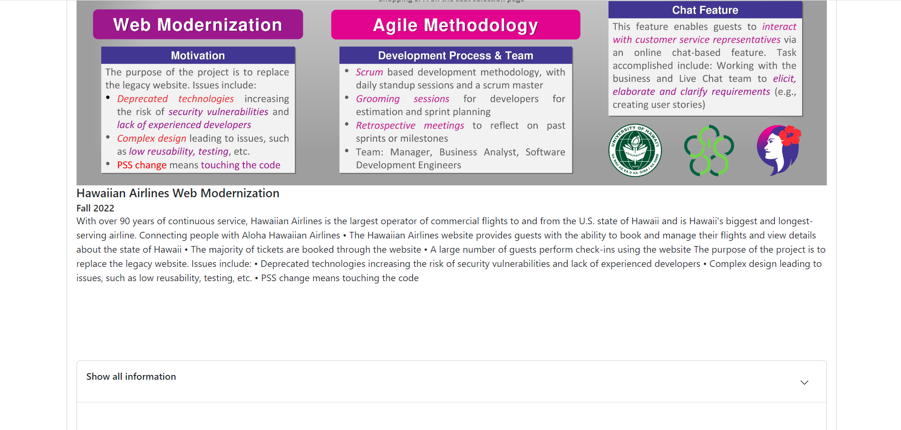

For web developers or those wishing to learn more about the code of this project, the source code is available here:
[https://project-portal-hawaii.github.io/](https://project-portal-hawaii.github.io/)

For those wishing to use or view the website portal the live deployment is available here: 
[https://project-portal.live](https://project-portal.live)

<h2>Project Portal Hawaii Overview</h2>
The project that my team and I created is a portal for students or organizations to propose projects, have those projects reviewed, approved, and showcased. This project was created in accordance to the specifications of UH Professors Anthony Peruma and Dan Port. The portal establishes a framework for classes with project formats similar to ICS 314 to expidite the project generation, selection, and approval process. 

The portal also creates a platform for the ICS capstone project and other organizations wishing to recognize sponsors or students to showcase the previously completed projects. This will allow inspiration for future projects and allow sponsors to view the fruition of the projects they supported.

<h2>My Contribution</h2>
For this project, I contributed to the creation of the minimum value product, the format of the collections used for projects, discussed and implemented the specifications of Professors Peruma and Port, and coded the jsx for the Showcase Projects Page. 

<h4>Showcase Projects Page</h4>

The showcase page I implemented fully renders the data of the showcased projects by filtering by status. It also uses a dropdown component to allow additional information to be displayed, including testimonals, instructor, and imbedded video.

<h2>Additional Information</h2>
Additional information regarding the Project Portal Hawaii Team, its members, and progression of the project is available here:
[https://project-portal-hawaii.github.io/](https://project-portal-hawaii.github.io/)
